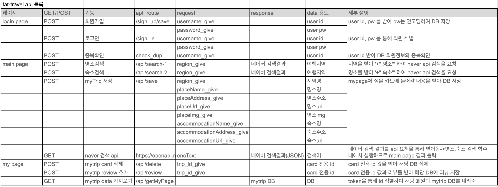

※ 블로그 글의 경우 실제 코드 구현에 대한 것 보다는 무언가 수행하며 전반적으로 깨닫게 된 것들에 대해 글로 풀어볼 생각이다. 코드에 구현 혹은 지식에 대한 부분은 [github.com/beadoer1/TIL](https://github.com/beadoer1/TIL) 이곳에 차곡차곡 모아보도록 하겠다.(좀 너저분하긴 한데 계속 정리하자.)

 3월 1일을 시작으로 항해99에 승선했고, 일주일의 시간이 흘렀다.  
비용과 수업방식에 대한 고민으로 걱정이 많았는데, 이에 대해 매주 WIL(Week I Learned) 방식으로 남겨보려 한다.  

### - 시작(미니 프로젝트 만들기)
 100명이 넘는 참가자와 함께 항해99가 시작되었다.  
 항해99는 매주 다른 사람들과 3명씩 팀을 이루어 새로운 미션을 시간에 맞게 해결해 나가는 방식으로 진행이 된다. 첫 주의 미션은 '미니 프로젝트 완성하기' 였고, 거기에 로그인 기능 및 서버 사이드 렌더링 조사/구현 등의 조건이 붙었다. 이를 통해 알게된 점과 앞으로 보강해야할 점은 아래와 같다.

1. 프로젝트를 통해 알게된 점
- **클라이언트 사이드(html,CSS,JS)와 서버 사이드(Python) 간의 소통방식에 대해 알게되었다.**
	- 클라이언트와 서버는 API(Application Programm Interface)를 통해 소통한다. API는 '특정 명령(업무)'을 수행하기 위한 '창구'이다.
	- SCC(스파르타코딩클럽)의 오프라인 웹개발 교육을 들었던 터라 익숙한 주제이긴 했으나, 당시에는 회사 업무와 병행해서 대략적으로만 알고 있던 개념이었는데 이번 기회에 보다 명확하게 알 수 있었다. 아래는 내가 속한 팀의 API 목록이다. 이전 교육 때 제일 어려워했던 개념이라 첫 주의 가장 큰 수확이라고 생각한다.
  

- **Team을 이뤄 프로젝트를 할 때 어떤 방식으로 해야할지 조금은 알게되었다.**
	- 이제 막 두 달밖에 안되긴 했지만, 혼자 공부를 하며 느꼈던 가장 큰 갈증이 **'협업에 대한 인지가 부족하다'**는 점이었다. 프론트엔드와 백엔드 개발자의 업무 분장은 어떻게 되는지, 분장 이후에는 무엇을 정해야하는지, 정하고나서는 언제 어떤식으로 공유하고 수정해나가야 하는지 등 경험해보지 못하면 알 수 없는 부분이라 답답함을 느꼈었다. 그리고 그게 이번 항해99에 지원한 가장 큰 계기가 되었다. 무튼, 이번을 계기로 생각해보게된 점은 아래와 같다.
	1. 기능을 나누고 API를 부여하고 주고 받을 변수의 종류와 이름을 정한다.
		- 팀플은 여럿이 하는 것이고, 여럿이 하는 작업에는 어떤 방식으로던지 서로 지켜야할 약속이 존재한다. 이 때 그 약속이 API 와 이 '창구'를 통해 주고받을 data의 정보가 된다. 처음 미션이 시작됐을 때, 이 부분을 명확히 해놓지 않아서 차후에 파일을 합치거나 함께 다른 사람의 코드를 리뷰할 때 자주 혼선이 빚어졌다.  
- html, CSS, Javascript를 더 자세히 알게 되었다.
	-

